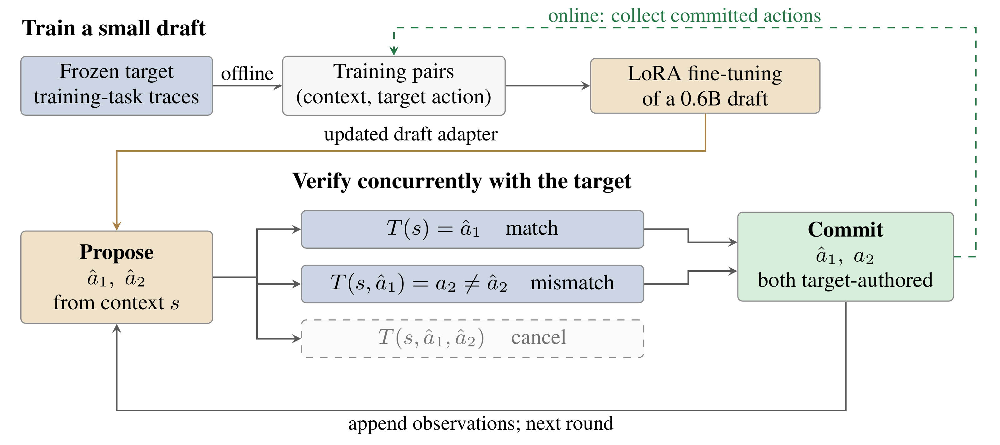

# LEAP: Learning Efficient Action Proposals for LLM Agents

Zhen Xu<sup>1</sup> · Qizheng Zhang<sup>2</sup> · Gerry Wan<sup>2</sup> · Shang Zhu<sup>3</sup> · Ce Zhang<sup>1</sup>

<sup>1</sup>University of Chicago · <sup>2</sup>Stanford University · <sup>3</sup>Together AI

**Preprint, 2026** · [Paper (arXiv)](https://arxiv.org/abs/2610.02670) · **Code: Coming soon**

## A tiny draft. A faster agent.

LLM agents spend much of their time waiting for the next decision. **LEAP teaches a small model to anticipate those decisions**, so a larger target model can verify several proposed action contexts concurrently and advance through a task faster.

The draft learns directly from the target's own actions, without reproducing its reasoning. The target stays frozen and verifies every committed action. A latency framework explains when the time saved outweighs the cost of drafting, verification, and tools.



*LEAP learns a small action drafter from the target agent, then accelerates execution through concurrent verification.*

## Learn. Propose. Verify.

1. **Learn the target's actions.** Train a lightweight LoRA adapter on context–action pairs collected from the target agent.
2. **Propose the next steps.** The small draft predicts a short sequence of actions without generating reasoning text.
3. **Verify and move forward.** The target verifies contexts concurrently. Commit the matching prefix and the target's next action, unless the task has ended.

### Keep learning as the agent runs.

Committed actions also supply new training data. LEAP can learn online without a separate trace-collection pass, reaching performance comparable to offline training in our experiments.

## Citation

```bibtex
@article{xu2026leap,
  title   = {{LEAP}: Learning Efficient Action Proposals for {LLM} Agents},
  author  = {Xu, Zhen and Zhang, Qizheng and Wan, Gerry and
             Zhu, Shang and Zhang, Ce},
  journal = {arXiv preprint arXiv:2610.02670},
  year    = {2026}
}
```
